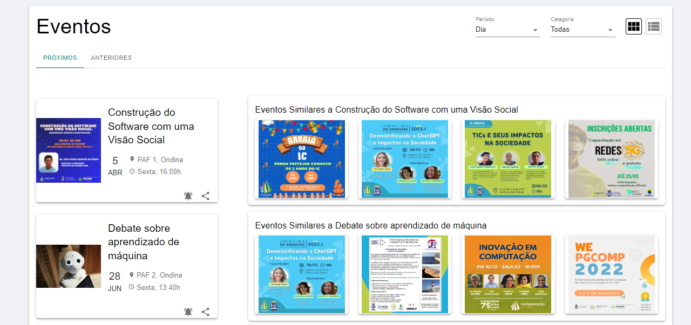
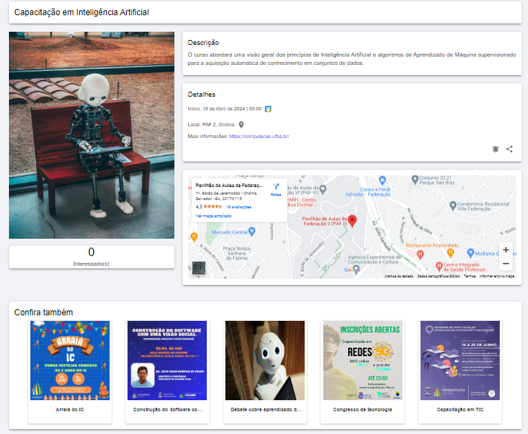
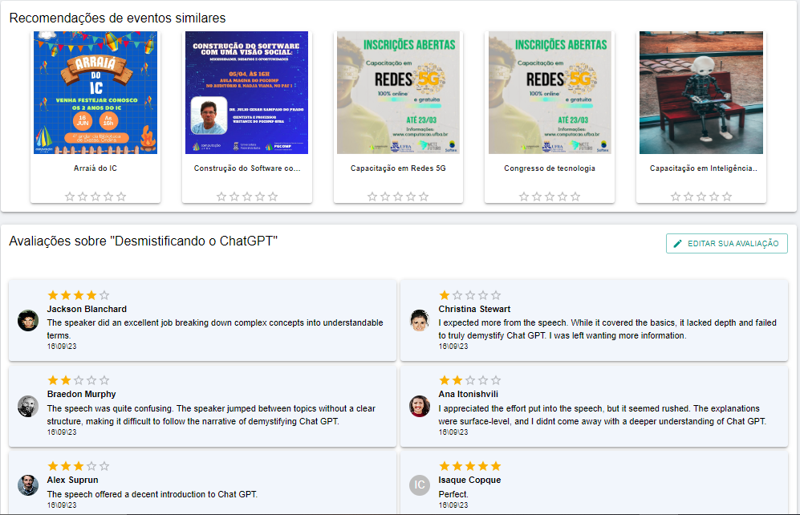
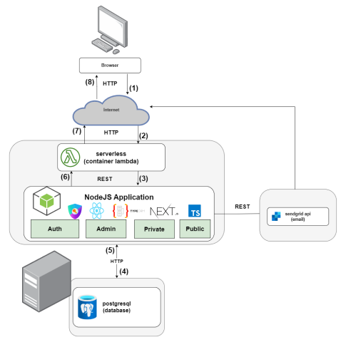

# EventIC: An Academic Event Recommender System for the Institute of Computing

## Abstract

Event promotion platforms play a crucial role in fostering connections because they can extend the reach and visibility of events. In the academic environment, characterized by frequent lectures, seminars, and conferences organized by various research groups, these tools enable students, researchers,and interested individuals to access information easily, driving the dissemination of knowledge within the scientific community. To further optimize this potential, a Recommendation System can be employed to help users discover relevant events. This work addressed integrating a recommendation mechanism,into a web application for promoting academic events, EventIC. Collaborative
Filtering and Content-Based Filtering techniques were employed, and a comparison experiment of the results from these approaches was conducted. The metrics adopted in this study indicated that Collaborative Filtering produced more accurate recommendations than Content-Based Filtering.

## Background

Nowadays, the Computing Institute of the Federal University of Bahia lacks a management system for academic events. Currently, events are fostered in a decentralized manner, utilizing emails, research group websites, and social media platforms. This dispersed approach poses challenges for the academic community in staying informed and actively engaging in these events.

In order to address this problem, we developed a web system named <a href="https://github.com/ic0045/eventic">**EventIC** - **The Computing Institute Events Platform** -</a> which allows students and interested people to take note of next events to be hosted and provides users with useful functionalities, including locating events by date, title or category, events integration into Google Calendar, easily sharing in social media and schedule an email notification before the event starts.

In my bachelor's thesis, I extended this project by implementing a recommendation system for event recommending. For user model capturing, I developed an evaluation mechanism in which users can rate an event between one and five stars and leave a comment. For those unregistered users, recommendations are generated by event content analysis.
The system produces event suggestions using Collaborative Filtering and Content-Based Filtering approaches. The experiment utilized a public dataset and the evaluation metrics indicated that Collaborative Filtering produced more accurate recommendations than Content-Based Filtering.

## Screenshots

*Recommendations on the home page.*

*Event details page.*

*Event reviews.*

## Architecture

## Technologies

- [NodeJS 18.15.0](https://nodejs.org/en/download) 
- [Typescript](https://www.typescriptlang.org)
- [ReactJS](https://pt-br.reactjs.org/)
- [NextJS](https://nextjs.org/)
- [NextAuth.js](https://next-auth.js.org/)
- [TypeOrm](https://typeorm.io/)
- [Good Enough Recommendations (GER)](https://www.npmjs.com/package/ger)
- [String Comparison](https://www.npmjs.com/package/string-comparison)
- [MaterialUI](https://mui.com/)
- [ReactAdmin](https://www.npmjs.com/package/react-admin)
- [Postgresql](https://www.postgresql.org)

## References

[Adomavicius and Tuzhilin 2005] Adomavicius, G. and Tuzhilin, A. (2005). Toward the
next generation of recommender systems: a survey of the state-of-the-art and possible
extensions. IEEE Transactions on Knowledge and Data Engineering, 17(6):734–749.

[Bag et al. 2019] Bag, S., Kumar, S., and Tiwari, M. (2019). An efficient recommendation
generation using relevant jaccard similarity. Information Sciences, 483:53–64.

[Bancu et al. 2012] Bancu, C., Dagadita, M., Dascalu, M., Dobre, C., Trausan-Matu, S., and
Florea, A. M. (2012). Arsys – article recommender system. In 2012 14th International
Symposium on Symbolic and Numeric Algorithms for Scientific Computing, pages 349–
355.

[Burke 2002] Burke, R. (2002). Hybrid recommender systems: Survey and experiments.
User Modeling and User-Adapted Interaction, 12.

[Cazella et al. 2010a] Cazella, S. C., Drumm, J. V., and Barbosa, J. L. V. (2010a). Um
servico para recomendacao de artigos cient  ıficos baseado em filtragem de conteudo 
aplicado a dispositivos moveis.  Revista Novas Tecnologias na Educacao , 8(3).

[Cazella et al. 2010b] Cazella, S. C., Nunes, M. A. S. N., and Reategui, E. B. (2010b). A
ciencia da opini  ao: Estado da arte em sistemas de recomendac  ao.  Andre Ponce de 
Leon F. de Carvalho.

[Cornelis et al. 2005] Cornelis, C., Guo, X., Lu, J., and Zhang, G. (2005). A fuzzy relational approach to event recommendation. In Proceedings of 2nd Indian International
Conference on Artificial Intelligence (IICAI’05), pages 2231–2242.

[Dooms, Simon and De Pessemier, Toon and Martens, Luc 2011] Dooms, Simon and De
Pessemier, Toon and Martens, Luc (2011). A user-centric evaluation of recommender
algorithms for an event recommendation system. In Felfernig, Alexander and Chen, Li
and Madl, Monika and Willemsen, Martijn and Bollen, Dirk and Ekstrand, Michael,
editor, Proceedings of the RecSys 2011 : Workshop on Human Decision Making in
Recommender Systems (Decisions@RecSys’11) and User-Centric Evaluation of Recommender Systems and Their Interfaces - 2 (UCERSTI 2) affiliated with the 5th ACM
Conference on Recommender Systems (RecSys 2011), pages 67–73. Ghent University,
Department of Information technology.

[Ferreira et al. 2017] Ferreira, J., Rosa, R., and Rodriguez, D. Z. (2017). Sistema de
recomendacao de t  opicos e recursos educacionais utilizando redes sociais. In  Anais
do XXVIII Simposio Brasileiro de Inform  atica na Educac  ao (SBIE 2017)  , page 1805.

[Horowitz et al. 2018] Horowitz, D., Contreras, D., and Salamo, M. (2018). Eventaware: 
A mobile recommender system for events. Pattern Recognition Letters, 105:121–134.
Machine Learning and Applications in Artificial Intelligence.

[Klamma et al. 2009] Klamma, R., Cuong, P. M., and Cao, Y. (2009). You never walk alone:
Recommending academic events based on social network analysis. In Zhou, J., editor,
Complex Sciences, pages 657–670, Berlin, Heidelberg. Springer Berlin Heidelberg.

[Lee 2008] Lee, D. H. (2008). Pittcult: Trust-based cultural event recommender. In Proceedings of the 2008 ACM Conference on Recommender Systems, RecSys ’08, page
311–314, New York, NY, USA. Association for Computing Machinery.

[Macedo 2015] Macedo, A. Q. d. (2015). Recomendacao multicontextual de eventos em 
redes sociais de eventos. Master’s thesis, Universidade Federal de Campina Grande,
Paraiba, Brasil. Dissertacao de Mestrado em Ciencia da Computacao. 

[npmjs 2017] npmjs (2017). Good enough recommendations (ger).
https://www.npmjs.com/package/ger. Accessed: 2024-02-14.

[npmjs 2023] npmjs (2023). string-comparison. https://www.npmjs.com/package/stringcomparison. Accessed: 2024-02-14.

[Rolim et al. 2017] Rolim, V., Ferreira, R., Costa, E., Pinheiro, A., and Ferreira, M. A.
(2017). Um estudo sobre sistemas de recomendacao de recursos educacionais.  Anais
dos Workshops do Congresso Brasileiro de Informatica na Educac  ao , page 724.

[Schafer et al. 2007] Schafer, J. B., Frankowski, D., Herlocker, J., and Sen, S. (2007). Collaborative filtering recommender systems. In Brusilovsky, P., Kobsa, A., and Nejdl,
W., editors, The Adaptive Web: Methods and Strategies of Web Personalization, pages
291–324, Berlin, Heidelberg. Springer Berlin Heidelberg.

[SHAH 2023] SHAH, Y. (2023). Blog recommendation data.
https://www.kaggle.com/datasets/yakshshah/blog-recommendation-data. Accessed:
2024-02-22.

[Valmorbida and Bugs 2020] Valmorbida, W. and Bugs, C. (2020). Sistema de
recomendacao de eventos utilizando o framework apache mahout.  Revista Destaques
Academicos  , 12.

[Wang et al. 2018] Wang, D., Liang, Y., Xu, D., Feng, X., and Guan, R. (2018). A contentbased recommender system for computer science publications. Knowledge-Based Systems, 157.

[Zisopoulos et al. 2008] Zisopoulos, C., Karagiannidis, S., Demirtsoglou, G., and Antaris,
S. (2008). Content-based recommendation systems. Proceedings of the International
Conference on Engineering and Technology Education.